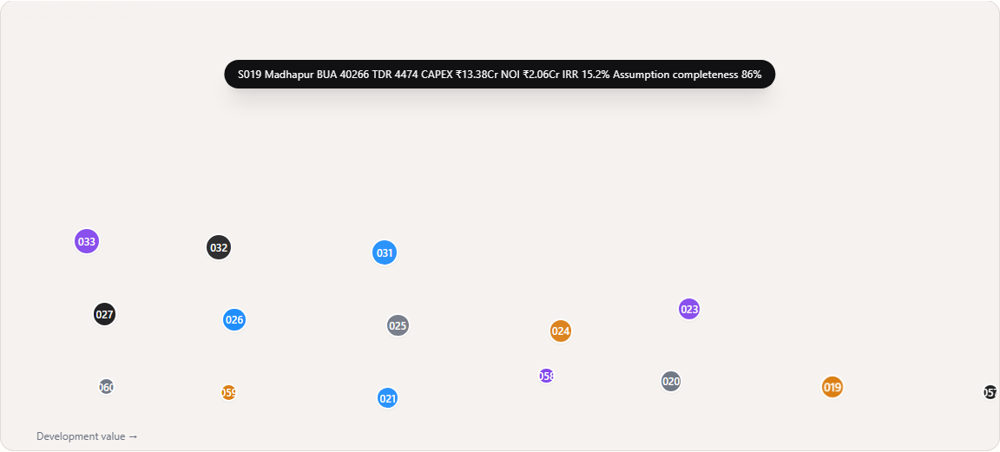

# SECOND LAND: Real Estate Financial Dashboard

  

  
  
  
  

## Overview

**SECOND LAND** is a highly specialized, deterministic financial modeling dashboard built for institutional real estate analysis in the IT Corridors of Hyderabad (Madhapur, Gachibowli, Kondapur). 

It models the complex urban economics of **Transferable Development Rights (TDR)** under Government Orders (G.O. 95 & 16), demonstrating exactly how buying air rights impacts base land value, vertical expansion (BUA), and financial feasibility across **60 distinct scenarios**.

## Features

### 🏛️ The 3D Feasibility Cube
A custom-built, isometric 3D rendering engine built purely with SVG math to visualize the 'stack'. It allows stakeholders to instantly comprehend the physical relationship between the base allowable build and the vertical extension unlocked by TDR capital.

  

### 📊 Spatial Financial Modeling
Traditional real estate analysis is trapped in unreadable Excel models. This dashboard takes complex financial outputs (IRR, NOI, CAPEX, Downside Resilience) and integrates them directly into a **MapLibre** geographic environment. An IRR of 18% means something entirely different in an established tech hub versus an emerging corridor.

### ⚡ Apple HIG Compliant 'Swiss Editorial' Design
The UI strictly adheres to Apple's Human Interface Guidelines for accessibility (touch targets, contrast ratios, typography scaling) while maintaining a dense, research-grade 'Swiss editorial' aesthetic. It doesn't look like a generic template—it looks like a serious institutional tool.

### 🚀 Zero-Dependency Single-File Bundle
Built with React and Vite, the entire application has been subverted into a single, highly portable Flagship-Final-Stable-No.html file. It runs 100% offline. No servers, no 
pm install, no setup. 

## Usage

Simply clone the repository and double-click Flagship-Final-Stable-No.html to open it in any modern browser.

`ash
git clone https://github.com/ShreyeshReddy005/SECOND-LAND.git
# Double-click Flagship-Final-Stable-No.html
`

## Methodology

This tool replaces traditional clunky Excel models (e.g., Institutional_LGSF_CoLiving_Master_Model_AUDITED.xlsx) by providing a genuine analytical interface. The 60 scenarios are deterministic, based on real data completeness:
* Location: 90%+
* TDR Price: 80%+
* Structural: 70%+
* Rent: 85%+
* Cost: 75%+
* Regulatory: 95%
*(Average 82% deterministic confidence).*
